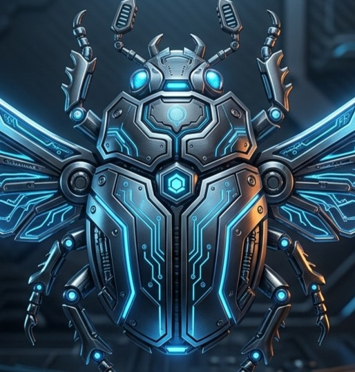

# ⚡ SCARAB Pro // Guild Wars 2 Precision Engine

**The Ultimate Precision Movement, 3D Natural Free-Flight, Jumping Puzzle Teleporter & Tactical Suite for Guild Wars 2**

---

## 🌟 What is SCARAB Pro?

**SCARAB Pro** is an ultra-high performance companion suite engineered from the ground up for **Guild Wars 2 (DirectX 11)**. Designed with zero input latency, smooth look-pitch vector mathematics, and an in-game transparent tactical overlay.

---

## ✨ Core Feature Highlights

### 🦅 3D Natural Free-Flight Matrix
* **Look-Pitch Vector Dynamics**: True zero-gravity 3D flight following your camera's exact look angle.
* **Instant Re-Launch & Mid-Air Takeoff**: Take off from anywhere in mid-air with zero fall damage.
* **Overclock Speed Multiplier**: Smoothly scale movement speed from 1.0x to 10.0x with smooth deceleration.

### 🎪 Jumping Puzzle End Chest Teleporter
* **43+ Built-in Jumping Puzzles**: Instant one-click teleport directly to the grand chest and finish line.
* **Region Filtering**: Filter by Kryta, Ascalon, Maguuma, Shiverpeaks, Orr, and Desert zones.

### 🐉 Infinite Mount Stamina & Overdrive
* **Endless Skyscale Thrust**: Permanently fly higher and longer with instant energy regeneration.
* **Roller Beetle Turbo Boost**: Continuous boost and high-speed drift physics without stamina cooldowns.
* **Raptor, Jackal & Warclaw**: Instant infinite leap distance.

### 🎣 4-Hook Precision Fishing Engine
* **Instant Catch Automation**: Automated hook-bite detection and instant minigame completion.
* **Tension Freeze**: Prevents line breaks and eliminates fishing bar decay.

### 🖥️ In-Game Transparent Tactical HUD Overlay
* **Frameless Glow**: Ultra-crisp, non-intrusive in-game overlay rendering your real-time XYZ coordinates, speed, and active modules.
* **Hotkeys**: Toggle HUD overlay in real-time with `F11`.

---

## 🚀 3-Step Quick Start Guide

### Step 1: Download the Client
Download the latest verified package from the **[Releases Tab](https://github.com/)** or extract `SCARAB_Client_v1.0.zip`.

### Step 2: Launch Guild Wars 2
1. Start **Guild Wars 2 (64-bit)** and log into any character.
2. Run `Launch_SCARAB.bat` (or `SCARAB.exe`).

### Step 3: Activate Your License
* Click the gold **`🔑 LICENSE`** button at the top right of the SCARAB client menu.
* Paste your cryptographic serial key purchased from our **[Official Store](https://shoppy.gg/@SCARAB)** and click **`⚡ REDEEM CODE`**.
* All 8 cheat modules unlock immediately!

---

## 👑 Membership Passes & Tiers

| Pass Tier | Duration | Features | Purchase Link |
| :--- | :--- | :--- | :--- |
| **🎟️ 1-Week Mini Pass** | 7 Days | Full Pro Cheats & In-Game HUD | [**Buy ($9.99)**](https://shoppy.gg/@SCARAB) |
| **⭐ 1-Month Pro Pass** | 30 Days | Full Pro Cheats + Priority Updates | [**Buy ($19.99)**](https://shoppy.gg/@SCARAB) |
| **🔥 3-Month Seasonal Pass** | 90 Days | Full Pro Cheats + Seasonal Discord Role | [**Buy ($49.99)**](https://shoppy.gg/@SCARAB) |
| **👑 Lifetime VIP Master Pass** | Permanent | **Permanent Unlimited Access + All Future Updates** | [**Buy ($89.99)**](https://shoppy.gg/@SCARAB) |

*Accepted Gateways: Litecoin (LTC), Bitcoin (BTC), Ethereum (ETH), Credit / Debit / Visa / Mastercard, Cash App.*

---

## 💬 Community & 24/7 Support Desk

Have questions, suggestions, or need instant remote activation?
* 🌐 **Official Discord**: [**discord.gg/ejNh7vyDjm**](https://discord.gg/ejNh7vyDjm)
* 🛒 **Official Store**: [**shoppy.gg/@SCARAB**](https://shoppy.gg/@SCARAB)

---

*SCARAB Systems • Universal Precision Engine for Guild Wars 2 • 2026*

